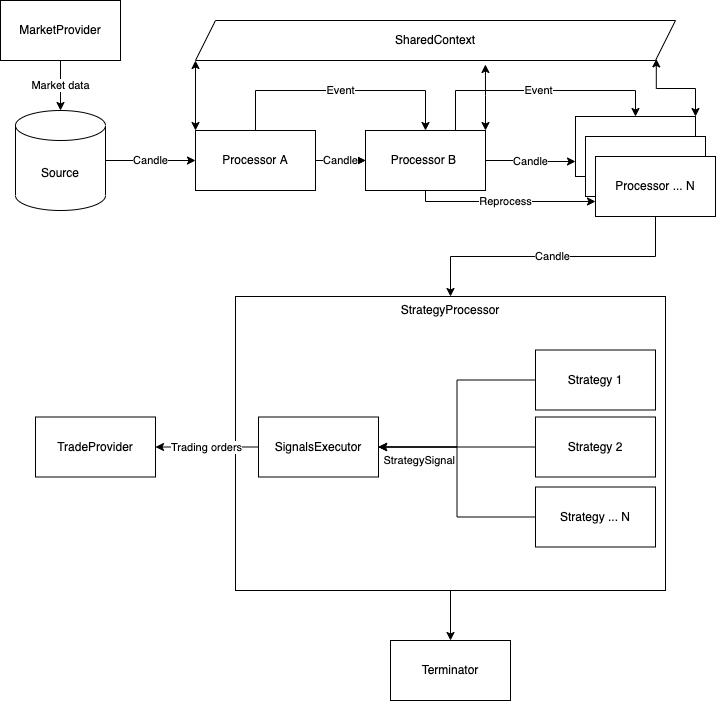

# algo-trader

Trading strategies builder, backtester, and real-time trader.

>pip install algorithmic-trader

## Intro

algo-trader is an implementation of an algorithmic trading strategy executor and backtester.
Capable of backtesting strategies locally and trading them in real-time via your broker API.

> Please be aware that this is a **work in progress** and the trader is missing external market data and trade
> providers.
> If you'd like to use the trader for real-world trading, you'll have to implement your broker API.
> Although real-time trading is not finished, backtesting is fully functional, so implemented strategies can be backtested
> and used in real trading when it will be ready.


algo-trader is written in Python, and its current stack composes of:

1. MongoDB as a backend data store for backtesting strategies
2. [tulipy](https://github.com/jesse-ai/tulipy) - Python bindings for [Tulip Indicators](https://tulipindicators.org/).
   Used to provide technical indicators calculations.
3. ib_client (Optional) - Python library to communicate with Interactive Brokers gateway. Only needed if you plan on
   doing real trading via IB.


## Architecture



### Pipeline

[Pipeline](src/algotrader/pipeline/pipeline.py) is the basic facilitator of the stream. It’s the orchestrator responsible for
reading data from the [Source](src/algotrader/pipeline/source.py) and moving it to the processors in the stream.
It has no actual logic except for facilitating the processors.
A pipeline and all of its child components are JSON serializable, that is for the system to be able to define, load and
save entire pipelines with their configurations on file.
This feature is an important one as it can be used as a facade for UI/CLI based runners.
Example serialized (and runnable) pipelines can be found in
the [examples/pipeline-templates](src/algotrader/examples/pipeline-templates) directory.
Example of loading them into [Pipeline](src/algotrader/pipeline/pipeline.py) and running them using
the [PipelineRunner](src/algotrader/pipeline/runner.py) can be found in [main.py](src/algotrader/main.py)

### PipelineRunner

A [PipelineRunner](src/algotrader/pipeline/runner.py) will accept an initial list or singular [Pipeline](src/algotrader/pipeline/pipeline.py),
and an optional starting [SharedContext](src/algotrader/pipeline/shared_context.py). If
a [SharedContext](src/algotrader/pipeline/shared_context.py) is not provided during construction, a new one will be initialized.
Each [Pipeline](src/algotrader/pipeline/pipeline.py) will be called through `run()` in the order that it was listed with the
previous context. The context will move through each [Pipeline](src/algotrader/pipeline/pipeline.py) allowing for some operations
such as loading, caching and validation to occur before data collection and sink.

### Sources

A [Source](src/algotrader/pipeline/source.py) is an implementation of a Candle Iterator. This is the starting point of the pipeline
and the "source" for the incoming candles processed.

### Processors

[Processor](src/algotrader/pipeline/processor.py) is the primary processing unit in the pipeline. Processors can be constructed in
any order while Candles are flowing from the source, forward through all processors.
Each processor is responsible for sending the candles it processes to the next processor (unless it has a reason not to)
.

The `process()` function gets with each candle also an object called [`SharedContext`](src/algotrader/pipeline/shared_context.py).
The context is an instance of an in-memory KV store to share context and information between processors.

Another way to share data between processors is to make use of the `attachments` field on the Candle itself.
This field is intended for metadata on the candle, like calculations and state relevant to that candle point in time.
Candle attachments are persistent throughout the pipeline.

#### Reprocessing

Reprocessing is a feature that enables a processor to re-send an already processed candle to the next processor.
Reprocessing is useful for processors that do some logic outside the main flow of the pipeline. for example, upon
events, external triggers, market/trade provider's events/issues, etc...
An example of reprocessing can be found in
the [AssetCorrelationProcessor](src/algotrader/pipeline/processors/assets_correlation.py)

### Events

An [Event](src/algotrader/entities/event.py) as its name suggests, defines an event that occurred in the system.
It follows the same flow as the Candles, passing between processors. Each processor is responsible for propagating the
event to the next processor (if needed).

Because pipelines are data-driven and not time-driven, events can be used as checkpoints to indicate something that
happened in the data stream.
For example, running the same pipeline from a DB source and a real-time market data source can have different effects if
the processor were to rely on time.

_It is crucial to have the same behavior when fast-running from DB and real-time for backtesting to be useful._

### Strategies

Strategies are executed per candle by the [StrategyProcessor](src/algotrader/pipeline/processors/strategy.py).
A strategy is responsible for executing the trading logic and dispatching
Signals ([StrategySignal](src/algotrader/entities/strategy_signal.py)).
In the event a strategy is raising a trading signal, the StrategyProcessor will catch and pass it to
the [SignalsExecutor](src/algotrader/trade/signals_executor.py) for execution.

### Terminators

A [Terminator](src/algotrader/pipeline/terminator.py) is an optional final piece of the pipeline. It's executed at the very end of
a pipeline when the Source iterator has been fully consumed.
Terminators are useful for unit testing, backtesting, and environment cleanups.

## Running locally

algo-trader is using MongoDB for data storage. To run Mongo locally use `docker-compose`.

```shell
docker-compose -f docker-compose.yml up -d
```

## CLI

The CLI is a simple interface to run the system. It can be used to run a pipeline, backtest a strategy, or run a
strategy in real-time.
Currently, the CLI is not fully implemented and most of the functionality is to `describe` and `list` the available
processors and strategies.
Running the CLI without any arguments will show the help menu.

When the package installed via PIP, the command `algo-trader` will be available. 
If you choose to clone this repo, use `python main.py` as your entry point.  

```shell
algo-trader
```

To list all available processors:

```shell
algo-trader processor list
```

To describe a specific processor:

```shell
algo-trader processor describe <processor_name>
```

Same pattern applies to strategies and sources.
In order to run a pipeline, you'll need to create a pipeline template file. and run it using the CLI.

```shell
algo-trader pipeline run <pipeline_template_file>
```

### Easy to run examples:

* Data loader from Yahoo finance can be found in [src/algotrader/examples/pipeline-templates/build_daily_yahoo_loader.py](src/algotrader/examples/pipeline-templates/build_daily_yahoo_loader.json). 
Running this example pipeline will load historical data from Yahoo finance to MongoDB:

   ```shell
   algo-trader pipeline run examples/pipeline-templates/build_daily_yahoo_loader.json
   ```
* Data loader from Binance can be found in [src/algotrader/examples/pipeline-templates/build_daily_binance_loader.json](src/algotrader/examples/pipeline-templates/build_daily_binance_loader.json). 
Running this example pipeline will load historical data from Binance to MongoDB:

   ```shell
   algo-trader pipeline run examples/pipeline-templates/build_daily_binance_loader.json
   ```

* Realtime Crypto pipeline from Binance can be found in [src/algotrader/examples/pipeline-templates/build_realtime_binance.json](src/algotrader/examples/pipeline-templates/build_realtime_binance.json). 
Running this example pipeline will process realtime, second candles from Binance:

   ```shell
   algo-trader pipeline run examples/pipeline-templates/build_realtime_binance.json
   ```

### Code example

Short code example with comments. This is how one would typically use `algo-trader` as a library to 
load and calculate technical indicators on stocks data from Yahoo finance to MongoDB

```python
from datetime import datetime, timedelta

from algotrader.calc.calculations import TechnicalCalculation
from algotrader.entities.timespan import TimeSpan
from algotrader.pipeline.configs.indicator_config import IndicatorConfig
from algotrader.pipeline.configs.technical_processor_config import TechnicalsProcessorConfig
from algotrader.pipeline.pipeline import Pipeline
from algotrader.pipeline.processors.candle_cache import CandleCache
from algotrader.pipeline.processors.storage_provider_sink import StorageSinkProcessor
from algotrader.pipeline.processors.technicals import TechnicalsProcessor
from algotrader.pipeline.runner import PipelineRunner
from algotrader.pipeline.sources.yahoo_finance_history import YahooFinanceHistorySource
from algotrader.storage.mongodb_storage import MongoDBStorage


def main():
    # create a MongoDB Storage connector
    mongodb_storage = MongoDBStorage()

    # Create a Yahoo finance Source connector
    source = YahooFinanceHistorySource(
        ['AAPL', 'MSFT', 'GOOG'],  # Pass in the list of symbols to fetch
        TimeSpan.Day,  # Choose the candles interval
        datetime.now() - timedelta(days=100),  # Date to start fetching from
        datetime.now()  # The last date to fetch to
    )

    # Create a MongoDB Sink processor that will save all processed candles to mongo
    # using the storage connector.
    sink = StorageSinkProcessor(mongodb_storage)

    # Cache processor acts like an in-memory cache and enable processors to share data between on another
    cache_processor = CandleCache(sink)
    # Create a technical indicators process that will add each candle with indicators data.
    # We then pass the candles to the cache processor, so we can later use this data and share it
    # with other processors if needed.
    technicals_config = TechnicalsProcessorConfig([
        IndicatorConfig('sma5', TechnicalCalculation.SMA, [5]),
        IndicatorConfig('sma20', TechnicalCalculation.SMA, [20]),
        IndicatorConfig('cci7', TechnicalCalculation.CCI, [7]),
        IndicatorConfig('cci14', TechnicalCalculation.CCI, [14]),
        IndicatorConfig('rsi7', TechnicalCalculation.CCI, [7]),
        IndicatorConfig('rsi14', TechnicalCalculation.CCI, [14]),
        IndicatorConfig('stddev5', TechnicalCalculation.STDDEV, [5]),
    ])

    processor = TechnicalsProcessor(technicals_config, cache_processor)

    # Construct the pipline object. This object can be serialized as JSON, saved, and reloaded whenever we need it.
    pipeline = Pipeline(source, processor)

    # Provide the Pipline object to the runner which will execute it.
    # The Runner can execute multiple pipelines one after the other.
    # This enabled the ability to construct a pipelines flow where each pipeline depends on another.
    PipelineRunner(pipeline).run()

```
  
## Using this repo locally

### Virtual environment

It is best to use a virtual environment to run algo-trader.

```shell
python3 -m venv run
source run/bin/activate
pip3 install -r requirements.txt
```

### Running tests

* Unit: `./scripts/test-unit.sh`
* Integration (needs IB gateway running): `./scripts/test-integration.sh`
* All: `./scripts/test-all.sh`

## Contributing

Contributions are welcome and much needed.
Please refer to the [guidelines](CONTRIBUTING.md).

